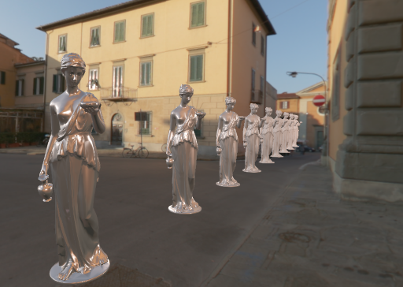
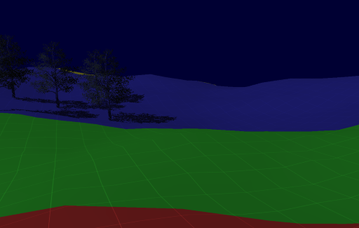

# Real-Time Rendering with Vulkan

## Features

* Screen Space Global Illumination
* Image Based Lighting
* Cascade Shadow Mapping
* Percentage Closer Soft Shadow
* Precomputed Radiance Transfer
* Kulla-Conty Approximation
* Ray Tracing and Denoising

## Todo

现在，程序还缺少交互功能，需要开发具有轨迹球或者弧形球功能的Camera类。

## Examples

## Requirements

* GLM
* GLFW3
* Vulkan SDK
* tiny_obj_loader

